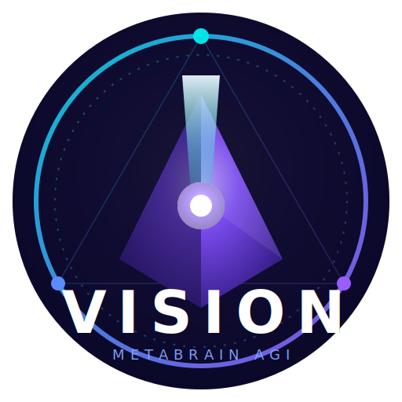

# VP-SIA

### The self-improving agent platform.

**Your agent gets measurably better at the work every time it runs — and it never regresses.**

VisionPRIME family · MetaBrainAGI · score-gated · compounding per-user memory · local-first

[Pricing](../PRICING.md) · [All products](../PRODUCTS.md) · [Request access](#request-access)

---

## The problem

Most agents run a fixed configuration — model tier, temperature, retries, parallelism, tool-call budget, skill loadout — until a human notices it's underperforming and edits the knobs by hand. The agent never learns from its own track record. Worse, when someone *does* tune it, there's no guarantee the change is actually better; "it ran" gets mistaken for "it ran well," and a quiet regression can ship.

## The solution

VP-SIA (Vision PRIME Self-Improving Agent) wraps any agentic workload in a closed learning loop — **RECALL → FORECAST → ACT → REMEMBER → TUNE** — that treats the harness as the thing to optimize, not a constant. Every run is scored, every score feeds a generational loop, and a new configuration only takes over when it **provably beats** the reigning one over enough real trajectories. The result is an agent that compounds: it builds a private, per-user record of what actually works for *your* tasks and steadily routes toward it — with a promotion rule that makes regressions structurally impossible.

## What you get

- **Score-gated champion/challenger loop.** A challenger is promoted only when its mean score beats the champion by a configurable margin over a minimum number of trajectories. Promotion is earned, never guessed — so regressions can't ship.
- **A score that respects the user, not just the task.** `0.55·success + 0.30·user_preference + 0.10·low_error + 0.05·efficiency`. A harness that technically succeeds but trips a correction or a disliked anti-pattern is penalized, so "it ran" never beats "it ran the way you wanted."
- **Compounding per-user memory.** Champions, challengers, and every scored generation persist as portable JSONL under your home directory — no database, no cloud round-trip, fully inspectable.
- **Three optional learning levers.** River (fast online per-outcome adaptation), XGBoost (batch win-prediction across champion + challengers), and Optuna (periodic search over the harness knob space that proposes the best parameter set as a real challenger) — all lazy-loaded, so the core loop runs in pure Python with zero heavy ML imports at load.
- **Self-mutating reliability.** When a correction fires against a losing champion, VP-SIA lowers temperature, raises retries, and hardens the skill loadout, then registers that as a fresh challenger to be earned back.
- **Thread-safe and idempotent.** An `RLock`-guarded loop; boot rebuilds all state from disk and is safe to call repeatedly.

## Why trust it

- **Regressions are structurally impossible** — the promotion gate is a measured margin over real trajectories, not a hunch.
- **Local-first and inspectable** — every champion, challenger, and scored generation is portable JSONL on your disk; no database, no telemetry, no cloud round-trip.
- **Zero-friction adoption** — the core loop is active the instant you import it; the ML levers are optional and lazy-loaded.

## Who it's for

Agent platforms, RL and eval teams, and anyone who dispatches the same class of task repeatedly and wants the harness to get better on its own — with a full audit trail and a hard guarantee against backsliding.

## Pricing

**Pro — from $79 / seat / mo** · one-time license $1,190 · Enterprise custom. See **[PRICING.md](../PRICING.md)** for the full table and bundles. VP-SIA is also included in the VisionPRIME flagship bundle.

## Request access

VP-SIA is in private launch. Source is private; access is granted with a license.

**[hello@metabrain.ai](mailto:hello@metabrain.ai)**

© MetaBrain AI — MetaBrainAGI. VP-SIA and the Vision mark are trademarks of MetaBrain AI. Not affiliated with Anthropic.

